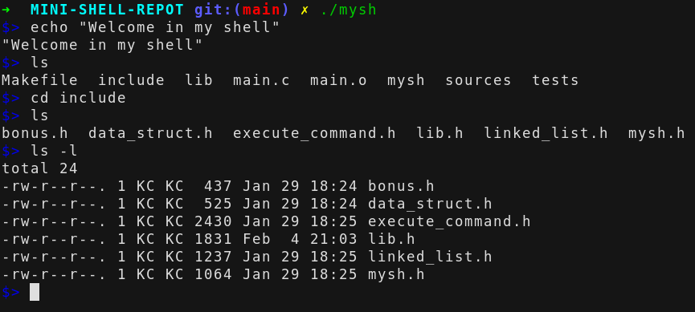

<!-- PROJECT LOGO -->
 
<h3>BUILD A SHELL</h3>

    

<!-- TABLE OF CONTENTS -->

  
Table of Contents

  <ol>
    <li>
      <a href="#about-the-project">About The Project</a>
    </li>
    <li>
       <a href="#how-to-use">How To Use</a>
    </li>
  </ol>

<!-- ABOUT THE PROJECT -->
## About The Project
 

    

(<a href="#top">back to top</a>)

Le Minishell est un projet réalisé au cours de la première année d'Epitech. C'est une implémentation basique d'un interpréteur de commandes (ou Shell Unix) en C.

Implémentations :
- Récupération de l'environnement
- Gestion de l'environnement à l'aide des builtins env, setenv, unsetenv
- Gestion du prompt à l'aide des variables d'environnement USER, PWD et HOME
- Récupération des binaires à l'aide de la variable d'environnement PATH
- Exécution des binaires avec arguments
- Détection des signaux (SIGINT) et builtin "exit" implément.
- Gestion de programme segfaultant

Projet respectant la norme Epitech : Un maximum de 5 fonctions par fichier, 24 lignes par fonction et 80 colonnes par ligne.
Les fonctions autorisées sont : write, malloc, free, exit, open, close, fork, execve.

## How To Use
 

* First build the project executing : `make`
* Launch as normal mode with : `./mysh`
* Exit shell : `pressing ^D`

(<a href="#top">back to top</a>)

